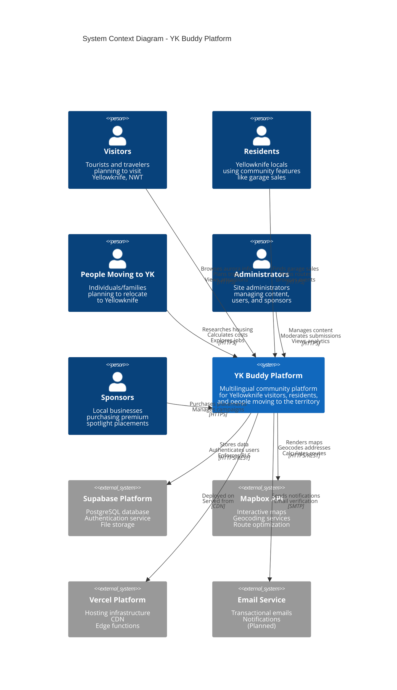

# Level 1: System Context Diagram

> High-level view of YK Buddy and its relationships with users and external systems

**Abstraction Level:** System Context (Level 1)
**Audience:** Everyone (including non-technical stakeholders)
**Last Updated:** January 2025

---

## Diagram



---

## System Description

### YK Buddy Platform

**Purpose:** A comprehensive, multilingual community platform serving three distinct user segments in Yellowknife, Northwest Territories.

**Key Capabilities:**

1. **For Visitors (Visiting Segment)**
   - Aurora viewing information and forecasts
   - Trip planning tools and seasonal guides
   - Tourist attractions and activities
   - Photography challenges

2. **For Residents (Living Segment)**
   - Garage sale planner with interactive maps
   - Route optimization for multiple sales
   - Local events calendar
   - Community knowledge base

3. **For People Moving (Moving Segment)**
   - Cost of living calculator
   - Housing market information
   - Job opportunities board
   - Newcomer checklists and guides

4. **For Administrators**
   - Content management and moderation
   - User management with granular permissions
   - Sponsor placement management
   - Analytics and reporting dashboard

5. **Cross-Cutting Features**
   - 9 language support (multilingual)
   - Premium spotlight system for sponsors
   - Mobile-responsive design
   - Northern-themed visual design

---

## Users and External Systems

### Primary Users

#### Visitors (Tourists)
- **Count:** Thousands annually
- **Use Cases:**
  - Research aurora viewing opportunities
  - Plan trip itineraries
  - Find accommodations and attractions
  - Learn about local culture
- **Access Pattern:** Sporadic, seasonal (aurora season)
- **Device:** Primarily mobile while traveling

#### Residents (Locals)
- **Count:** ~20,000 potential users
- **Use Cases:**
  - Find nearby garage sales
  - Plan efficient shopping routes
  - Share local knowledge
  - Discover community events
- **Access Pattern:** Regular, especially weekends
- **Device:** Mix of mobile and desktop

#### People Moving to YK
- **Count:** Hundreds annually
- **Use Cases:**
  - Research cost of living
  - Find housing options
  - Explore job opportunities
  - Prepare for relocation
- **Access Pattern:** Intensive during planning phase
- **Device:** Primarily desktop for research

#### Administrators
- **Count:** 2-10 staff members
- **Use Cases:**
  - Moderate user-generated content
  - Manage user permissions
  - Configure site settings
  - Monitor analytics
  - Manage sponsor placements
- **Access Pattern:** Daily
- **Device:** Desktop preferred

#### Sponsors (Businesses)
- **Count:** 10-50 active sponsors
- **Use Cases:**
  - Purchase premium spotlight placements
  - Track campaign performance
  - Update business information
- **Access Pattern:** Weekly/monthly
- **Device:** Desktop

### External Systems

#### Supabase Platform
- **Purpose:** Backend-as-a-Service providing database, auth, and storage
- **Components:**
  - PostgreSQL database with Row Level Security
  - Authentication service (email/password, OAuth)
  - File storage for images (future)
  - Real-time subscriptions (future)
- **SLA:** 99.9% uptime (free tier)
- **Data Flow:** Bidirectional (read/write)

#### Mapbox API
- **Purpose:** Maps and location services
- **Components:**
  - Interactive map rendering (Mapbox GL JS)
  - Geocoding API (address → coordinates)
  - Directions API (route optimization)
- **SLA:** 99.9% uptime
- **Rate Limits:** 100,000 free requests/month
- **Data Flow:** YK Buddy → Mapbox (requests)

#### Vercel Platform
- **Purpose:** Hosting and CDN infrastructure
- **Components:**
  - Edge network for global CDN
  - Serverless functions for API routes
  - Preview deployments for PRs
- **SLA:** 99.99% uptime
- **Data Flow:** Serves static assets and API routes

#### Email Service (Planned)
- **Purpose:** Transactional emails and notifications
- **Potential Provider:** SendGrid, Postmark, or Supabase (planned)
- **Use Cases:**
  - Email verification
  - Password reset
  - Sponsor campaign notifications
  - Admin alerts

---

## Key Interactions

### User Journeys

#### Visitor Journey: Planning an Aurora Trip
1. Visitor lands on homepage
2. Selects preferred language
3. Navigates to /visiting section
4. Views aurora forecast and best viewing times
5. Browses photography challenge submissions
6. Saves trip itinerary (if logged in)

#### Resident Journey: Finding Garage Sales
1. Resident logs in
2. Navigates to /living/garage-sales
3. Views garage sales on interactive map
4. Filters by date/time
5. Adds sales to route planner
6. Generates optimized driving route
7. Exports directions to phone

#### Mover Journey: Researching Costs
1. Potential mover visits site
2. Navigates to /moving section
3. Uses cost of living calculator
4. Inputs current location and income
5. Views comparison with Yellowknife
6. Browses housing listings
7. Explores job board

#### Admin Journey: Managing Content
1. Admin logs in with credentials
2. Dashboard shows pending moderation items
3. Reviews garage sale submission
4. Approves/rejects with notes
5. Checks sponsor placements
6. Views analytics dashboard
7. Activity logged to audit trail

### Data Flows

#### Authentication Flow
```
User → YK Buddy → Supabase Auth → PostgreSQL → Supabase Auth → YK Buddy → User
```

#### Map Interaction Flow
```
User → YK Buddy → Mapbox API → YK Buddy → User
       ↓                              ↑
   PostgreSQL (cached geocodes)
```

#### Content Moderation Flow
```
User Submit → YK Buddy → PostgreSQL (pending)
                ↓
           Admin Review
                ↓
         YK Buddy → PostgreSQL (approved/rejected)
                ↓
           Activity Log
```

---

## Business Context

### Goals and Drivers

1. **Strengthen Community** - Connect Yellowknife residents with resources and each other
2. **Boost Tourism** - Help visitors plan better trips and discover local gems
3. **Facilitate Relocation** - Make moving to YK easier with comprehensive information
4. **Generate Revenue** - Sustainable business model through sponsor placements
5. **Preserve Knowledge** - Community-driven knowledge base for local information

### Success Metrics

- **User Growth:** 1,000+ registered users in first year
- **Content:** 500+ knowledge base articles, 100+ garage sales/season
- **Sponsors:** 10+ active sponsors generating $3,000+/month
- **Engagement:** 50%+ return visitor rate
- **Performance:** <2s page load time globally

### Constraints

- **Budget:** ~$1/month operational costs (free tiers)
- **Team:** Small development team (1-2 developers)
- **Time:** Built in 3-4 months
- **Scale:** Community-scale (not millions of users)

---

## Technical Context

### Communication Patterns

| From | To | Protocol | Data Format | Purpose |
|------|----|---------| ------------|---------|
| Users | YK Buddy | HTTPS | HTML/JSON | All interactions |
| YK Buddy | Supabase | HTTPS | JSON/REST | Database operations |
| YK Buddy | Mapbox | HTTPS | JSON/REST | Map services |
| YK Buddy | Vercel | CDN | Static assets | Asset delivery |

### Security Boundaries

- **Public Zone:** Homepage, public pages (no auth required)
- **User Zone:** Profile, saved content (auth required)
- **Admin Zone:** Dashboard, moderation (admin role required)
- **Super Admin Zone:** User management, settings (super admin required)

---

## Deployment Context

### Environments

1. **Production:** `ykbuddy.com` (planned)
2. **Staging:** Vercel preview deployments
3. **Development:** `localhost:3002`

### Regions

- **Primary:** North America (closest to Yellowknife)
- **CDN:** Global edge network via Vercel
- **Database:** Single region (North America)

---

## Dependencies and Risks

### Critical Dependencies

| Dependency | Criticality | Mitigation |
|-----------|-------------|------------|
| Supabase | HIGH | Regular backups, migration scripts ready |
| Vercel | HIGH | Can deploy to other providers (Netlify, AWS) |
| Mapbox | MEDIUM | Can switch to Google Maps or OpenStreetMap |

### Key Risks

1. **Free Tier Limits** - May exceed Supabase/Vercel free tiers with growth
   - *Mitigation:* Monitor usage, optimize queries, budget for paid plans

2. **Data Loss** - Potential database corruption or deletion
   - *Mitigation:* Regular automated backups, point-in-time recovery

3. **API Rate Limits** - Mapbox API limits exceeded
   - *Mitigation:* Caching, rate limiting, alternative providers

4. **Vendor Lock-in** - Heavy dependence on Supabase
   - *Mitigation:* Standard PostgreSQL, migration scripts documented

---

## Related Documentation

- **[Next Level: Container Diagram →](./02-container-diagram.md)**
- **[Arc42: System Context](../arc42/03-context-scope.md)**
- **[Architecture Decision Records](../adr/README.md)**
- **[← Back to C4 Model Index](./README.md)**

---

**Last Updated:** January 2025
**Maintained By:** Development Team
**Review Cycle:** Quarterly
