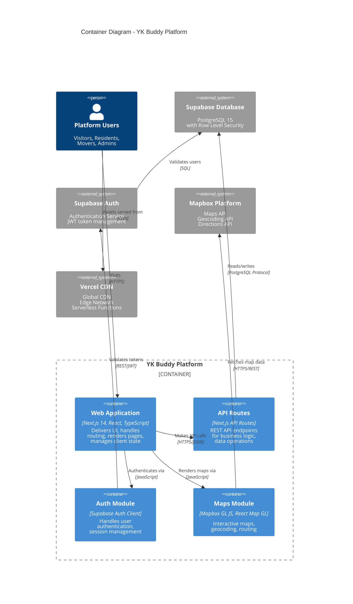

# Level 2: Container Diagram

> Shows the high-level technical building blocks (containers) that make up YK Buddy

**Abstraction Level:** Container (Level 2)
**Audience:** Technical people inside and outside the development team
**Last Updated:** January 2025

---

## Diagram



---

## Container Descriptions

### Web Application (Next.js 14)

**Technology:** Next.js 14 (App Router), React 18, TypeScript, Tailwind CSS

**Responsibilities:**
- Server-side rendering (SSR) for SEO and performance
- Client-side routing and navigation
- UI component rendering
- State management (React Context, Zustand)
- Form handling and validation
- Client-side caching (TanStack Query)

**Key Components:**
- App Router pages (`/visiting`, `/living`, `/moving`, `/admin`)
- Reusable UI components (Header, Footer, Cards, etc.)
- Context providers (Language, Auth, Slogan)
- Layout components
- Error boundaries

**Deployment:**
- Hosted on Vercel
- Serverless deployment model
- Automatic builds from git pushes
- Preview deployments for pull requests

**Port/Protocol:** HTTPS (443)

**Data Storage:**
- Client-side: localStorage (language preferences, UI state)
- Session storage: Temporary form data
- No sensitive data stored client-side

---

### API Routes (Next.js API Routes)

**Technology:** Next.js API Routes, TypeScript, Zod validation

**Responsibilities:**
- RESTful API endpoints for data operations
- Business logic execution
- Data validation and sanitization
- Authentication and authorization checks
- Database query composition
- Error handling and logging

**Key Endpoints:**

#### Admin APIs
- `POST /api/admin/users` - User management
- `POST /api/admin/users/permissions` - Permission management
- `GET /api/admin/users` - List users

#### Knowledge Base APIs
- `GET /api/knowledge` - List knowledge articles
- `GET /api/knowledge/[id]` - Get specific article
- `GET /api/knowledge/categories` - List categories
- `POST /api/knowledge/admin/review` - Moderate articles
- `GET /api/knowledge/admin/stats` - Admin statistics

#### Authentication APIs
- `GET /api/auth/callback` - OAuth callback handler
- `POST /api/auth/login` - Email/password login
- `POST /api/auth/signup` - User registration

**Deployment:**
- Serverless functions on Vercel
- Cold start optimization applied
- Request/response caching where appropriate

**Port/Protocol:** HTTPS (443)

**Security:**
- JWT token validation on protected routes
- Row-level security enforcement
- Input validation with Zod
- Rate limiting (future enhancement)

---

### Auth Module (Supabase Client)

**Technology:** @supabase/ssr, @supabase/supabase-js

**Responsibilities:**
- User authentication (email/password)
- OAuth integration (Google, future)
- Session management and token refresh
- Password reset flows
- Email verification
- Role and permission checking

**Authentication Methods:**
1. **Email/Password** - Primary method
2. **OAuth** - Google Sign-In (planned)
3. **Magic Links** - Passwordless auth (future)

**Session Management:**
- JWT tokens stored in HTTP-only cookies
- Automatic token refresh
- Secure session handling in server components
- Client-side session persistence

**Integration Points:**
- Wraps Supabase Auth service
- Used by API routes for auth checks
- Provides AuthContext to React components
- Server-side auth helpers for Next.js

**Security Features:**
- HTTP-only cookies
- PKCE flow for OAuth
- Token rotation
- Secure token storage

---

### Maps Module (Mapbox GL)

**Technology:** mapbox-gl, react-map-gl, TypeScript

**Responsibilities:**
- Interactive map rendering
- Geocoding (address → coordinates)
- Reverse geocoding (coordinates → address)
- Route calculation and optimization
- Distance calculations
- Marker and overlay management

**Key Features:**

#### Garage Sale Map
- Display garage sales as markers
- Clustering for dense areas
- Popup information on click
- Route line rendering
- User location tracking

#### Map Interactions
- Pan and zoom
- Mobile touch gestures
- Geolocation API integration
- Custom marker icons
- Route visualization

**Map Styles:**
- Primary: Mapbox Streets
- Dark mode: Mapbox Dark
- Custom style with northern theme

**Performance Optimizations:**
- Marker clustering
- Viewport-based rendering
- Debounced pan/zoom events
- Cached geocoding results

**Data Storage:**
- Geocoding cache in localStorage
- Map state in component state
- Route data in Zustand store

---

## External Systems Detail

### Supabase Database (PostgreSQL 15)

**Tables:**
- `profiles` - User profiles and admin flags
- `garage_sales` - Garage sale listings
- `premium_sponsors` - Sponsor placements
- `premium_pricing_plans` - Pricing configuration
- `knowledge_base` - Knowledge articles
- `knowledge_categories` - Article categories
- `user_permissions` - Granular admin permissions
- `admin_activity_log` - Audit trail
- `site_settings` - Configuration
- `aurora_photos` - User-submitted aurora photos

**Security:**
- Row Level Security (RLS) policies on all tables
- Function-level security
- Prepared statements (SQL injection prevention)
- Encrypted at rest and in transit

**Performance:**
- Indexes on frequently queried columns
- Connection pooling via Supabase
- Query optimization
- Materialized views (future)

**Backup:**
- Supabase automatic backups
- Point-in-time recovery (PITR)
- Export scripts for migrations

---

### Supabase Auth Service

**Features:**
- Email/password authentication
- OAuth provider integration
- Email verification
- Password reset
- JWT token issuance and validation
- User metadata management

**Configuration:**
- Email templates customized
- Token expiration: 1 hour (access), 7 days (refresh)
- Password requirements: 8+ characters, mix of types
- Rate limiting enabled

**Integration:**
- Called via @supabase/ssr client
- JWT tokens validated in API routes
- User sessions synchronized with database

---

### Mapbox Platform

**APIs Used:**

#### Mapbox GL JS
- Interactive map library
- WebGL-based rendering
- Custom style support
- 50,000 free map loads/month

#### Geocoding API
- Forward geocoding (address → coordinates)
- Reverse geocoding (coordinates → address)
- 100,000 free requests/month
- Response caching implemented

#### Directions API
- Route calculation
- Turn-by-turn directions
- Travel time estimation
- Traffic-aware routing (optional)

**API Key Management:**
- Public token for map display
- Restricted to ykbuddy.com domain
- Usage monitoring enabled
- Fallback to cached data if limit reached

---

### Vercel CDN

**Features:**
- Global edge network (70+ locations)
- Automatic SSL/TLS
- HTTP/2 and HTTP/3 support
- Brotli compression
- Image optimization

**Edge Functions:**
- Geolocation-based routing
- A/B testing capabilities
- Edge caching
- ISR (Incremental Static Regeneration)

**Build Process:**
- Automatic builds on git push
- Preview deployments for PRs
- Production deployment on merge to main
- Build cache for faster deploys

**Monitoring:**
- Real-time analytics
- Error tracking
- Performance metrics
- Bandwidth usage

---

## Data Flow Examples

### User Login Flow

```
1. User submits login form
   ↓
2. Web App → Auth Module: authenticate(email, password)
   ↓
3. Auth Module → Supabase Auth: signInWithPassword()
   ↓
4. Supabase Auth → Supabase DB: validate credentials
   ↓
5. Supabase Auth → Auth Module: { access_token, refresh_token, user }
   ↓
6. Auth Module → Web App: set session cookies, update context
   ↓
7. Web App: redirect to dashboard
```

### Garage Sale Creation Flow

```
1. User fills out garage sale form
   ↓
2. Web App → Maps Module: geocode(address)
   ↓
3. Maps Module → Mapbox API: GET /geocoding/v5/mapbox.places/{address}
   ↓
4. Mapbox API → Maps Module: { lat, lng, ... }
   ↓
5. Web App → API Routes: POST /api/garage-sales
   ↓
6. API Routes: validate auth, check permissions
   ↓
7. API Routes → Supabase DB: INSERT INTO garage_sales
   ↓
8. Supabase DB: RLS checks, triggers fire
   ↓
9. API Routes → Admin Activity Log: log creation
   ↓
10. API Routes → Web App: { success, sale_id }
   ↓
11. Web App: show success message, redirect
```

### Admin Content Moderation Flow

```
1. Admin views pending content
   ↓
2. Web App → API Routes: GET /api/knowledge/admin/review
   ↓
3. API Routes: check is_admin permission
   ↓
4. API Routes → Supabase DB: SELECT pending articles
   ↓
5. Web App: displays articles for review
   ↓
6. Admin approves/rejects article
   ↓
7. Web App → API Routes: POST /api/knowledge/admin/review
   ↓
8. API Routes: validate super_admin permission
   ↓
9. API Routes → Supabase DB: UPDATE status
   ↓
10. API Routes → Admin Activity Log: log action
   ↓
11. Web App: update UI, show next item
```

---

## Technology Stack Summary

### Frontend Stack

| Technology | Version | Purpose |
|-----------|---------|---------|
| Next.js | 14.0.4 | React framework, SSR, routing |
| React | 18.2.0 | UI library |
| TypeScript | 5.3.3 | Type safety |
| Tailwind CSS | 3.4.0 | Utility-first CSS |
| Zustand | 4.4.7 | Client state management |
| TanStack Query | 5.14.2 | Server state, caching |
| React Hook Form | 7.49.2 | Form management |
| Zod | 3.22.4 | Schema validation |

### Backend/Integration Stack

| Technology | Version | Purpose |
|-----------|---------|---------|
| Supabase JS | 2.76.1 | Database client |
| Supabase SSR | 0.7.0 | Server-side auth |
| Mapbox GL | 3.0.1 | Map rendering |
| React Map GL | 7.1.7 | React Mapbox wrapper |
| date-fns | 3.0.6 | Date manipulation |
| Axios | 1.6.2 | HTTP client |

### Development Stack

| Technology | Version | Purpose |
|-----------|---------|---------|
| ESLint | 8.56.0 | Code linting |
| Prettier | 3.0.0 | Code formatting |
| Vitest | Latest | Unit testing |
| TypeScript | 5.3.3 | Type checking |

---

## Deployment Architecture

### Production Environment

```
┌─────────────────────────────────────────┐
│           Vercel Edge Network           │
│  (Global CDN, SSL/TLS, Edge Functions)  │
└─────────────────┬───────────────────────┘
                  │
                  ↓
┌─────────────────────────────────────────┐
│       Next.js Application (SSR)         │
│   ┌───────────┬──────────┬──────────┐   │
│   │    App    │   API    │  Static  │   │
│   │   Router  │  Routes  │  Assets  │   │
│   └───────────┴──────────┴──────────┘   │
└──┬────────────────────────────────────┬─┘
   │                                    │
   ↓                                    ↓
┌──────────────────┐          ┌───────────────┐
│  Supabase Cloud  │          │  Mapbox Cloud │
│  ┌────────────┐  │          │  ┌──────────┐ │
│  │ PostgreSQL │  │          │  │ Maps API │ │
│  │    Auth    │  │          │  │ Geocode  │ │
│  │  Storage   │  │          │  │ Routing  │ │
│  └────────────┘  │          │  └──────────┘ │
└──────────────────┘          └───────────────┘
```

### Communication Patterns

| From Container | To Container/System | Protocol | Async? | Purpose |
|---------------|--------------------|---------| -------|---------|
| Web App | API Routes | HTTPS/JSON | No | Data operations |
| Web App | Vercel CDN | HTTPS | No | Static assets |
| API Routes | Supabase DB | PostgreSQL | No | Database queries |
| Auth Module | Supabase Auth | HTTPS/REST | No | Authentication |
| Maps Module | Mapbox API | HTTPS/REST | No | Map services |

---

## Scalability Considerations

### Current Capacity

- **Web App:** Serverless, scales automatically with Vercel
- **API Routes:** 100GB bandwidth/month free, then $0.15/GB
- **Database:** 500MB storage, 50,000 requests/month free
- **Maps:** 50,000 map loads, 100,000 API calls/month free

### Scaling Triggers

1. **10,000+ monthly active users** → Upgrade Supabase ($25/month)
2. **100+ GB bandwidth** → Pay-as-you-go Vercel ($0.15/GB)
3. **50,000+ map loads** → Upgrade Mapbox or implement tiling

### Performance Optimizations

- Static page generation where possible
- API route response caching
- Database connection pooling
- Image optimization (Next.js Image)
- Code splitting and lazy loading
- Service worker for offline support (future)

---

## Security Architecture

### Security Layers

1. **Network Layer**
   - HTTPS everywhere (TLS 1.3)
   - CORS configuration
   - Rate limiting (Vercel)

2. **Application Layer**
   - Input validation (Zod)
   - SQL injection prevention (parameterized queries)
   - XSS prevention (React escaping)
   - CSRF protection (same-site cookies)

3. **Authentication Layer**
   - JWT tokens in HTTP-only cookies
   - Token expiration and rotation
   - Password hashing (bcrypt via Supabase)
   - OAuth PKCE flow

4. **Authorization Layer**
   - Role-based access control (RBAC)
   - Row-level security (RLS) in database
   - Granular permission checking
   - Admin activity logging

5. **Data Layer**
   - Encrypted at rest (Supabase)
   - Encrypted in transit (TLS)
   - Automatic backups
   - Point-in-time recovery

---

## Related Documentation

- **[← Previous: System Context](./01-system-context.md)**
- **[Next: Component Diagram →](./03-component-diagram.md)**
- **[Arc42: Building Blocks](../arc42/05-building-blocks.md)**
- **[Deployment Architecture](../deployment-architecture.md)**
- **[← Back to C4 Model Index](./README.md)**

---

**Last Updated:** January 2025
**Maintained By:** Development Team
**Review Cycle:** Monthly or when architecture changes
