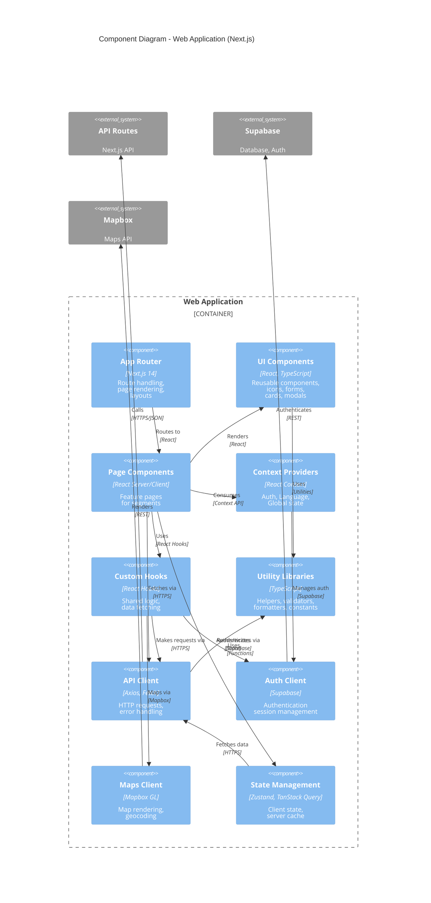

# Level 3: Component Diagram

> Shows the internal structure and components within the Web Application container

**Abstraction Level:** Component (Level 3)
**Audience:** Developers and architects
**Last Updated:** January 2025

---

## Web Application Components



---

## Component Details

### 1. App Router

**Path:** `apps/web/src/app/`
**Technology:** Next.js 14 App Router
**Responsibility:** Application routing and page rendering

**Key Files:**
- `layout.tsx` - Root layout with providers
- `page.tsx` - Homepage
- `visiting/page.tsx` - Visiting segment
- `living/page.tsx` - Living segment
- `moving/page.tsx` - Moving segment
- `admin/page.tsx` - Admin dashboard
- `error.tsx` - Error boundary
- `not-found.tsx` - 404 page

**Features:**
- File-based routing
- Server and client components
- Nested layouts
- Loading states
- Error boundaries
- Route groups for organization

**Interactions:**
- Routes requests to page components
- Applies layouts hierarchically
- Handles navigation
- Manages metadata for SEO

---

### 2. UI Components

**Path:** `apps/web/src/components/`
**Technology:** React 18, TypeScript, Tailwind CSS
**Responsibility:** Reusable UI building blocks

**Component Categories:**

#### Layout Components
- `Header.tsx` - Site header with navigation
- `Footer.tsx` - Site footer
- `Sidebar.tsx` - Admin sidebar navigation
- `MobileMenu.tsx` - Mobile navigation drawer

#### Feature Components
- `EnhancedPathwayCards.tsx` - Homepage segment cards
- `PremiumSpotlight.tsx` - Sponsor placement display
- `LanguageSelector.tsx` - Language switcher
- `NorthernIcons.tsx` - Custom SVG icons

#### Form Components
- `Input.tsx` - Text input with validation
- `Select.tsx` - Dropdown select
- `DatePicker.tsx` - Date selection
- `FormField.tsx` - Form field wrapper

#### Garage Sale Components
- `GarageSaleMap.tsx` - Interactive map display
- `GarageSaleCard.tsx` - Sale listing card
- `RouteOptimizer.tsx` - Route planning UI
- `DistanceCalculator.tsx` - Distance display

#### Common Components
- `Button.tsx` - Styled button variants
- `Card.tsx` - Content card container
- `Modal.tsx` - Modal dialog
- `Toast.tsx` - Notification toast
- `Spinner.tsx` - Loading spinner
- `Badge.tsx` - Status badges

**Design System:**
- Aurora color palette (green, blue, purple)
- Mobile-first responsive design
- Touch-friendly targets (44px+)
- Safe area support
- Dark mode compatible (future)

---

### 3. Page Components

**Path:** `apps/web/src/app/*/page.tsx`
**Technology:** React Server/Client Components
**Responsibility:** Feature-specific page implementations

**Segments:**

#### Visiting (`/visiting`)
- Aurora forecast display
- Trip planning tools
- Photography challenges
- Seasonal guides

#### Living (`/living`)
- Garage sale map and listings
- Route planner
- Community events
- Local resources

#### Moving (`/moving`)
- Cost calculator
- Housing information
- Job board
- Relocation guides

#### Admin (`/admin`)
- Dashboard overview
- User management
- Content moderation
- Sponsor management
- Analytics
- Settings

**Pattern:**
```typescript
// Server Component (default)
export default async function Page() {
  const data = await fetchData(); // Server-side
  return <ClientComponent data={data} />;
}

// Client Component
'use client';
export function ClientComponent({ data }) {
  const [state, setState] = useState(data);
  // Client-side interactivity
}
```

---

### 4. Context Providers

**Path:** `apps/web/src/contexts/`
**Technology:** React Context API
**Responsibility:** Global application state

**Contexts:**

#### AuthContext.tsx
```typescript
interface AuthContextType {
  user: User | null;
  isLoading: boolean;
  isAdmin: boolean;
  permissions: UserPermissions | null;
  signIn: (email: string, password: string) => Promise<void>;
  signOut: () => Promise<void>;
  signUp: (email: string, password: string) => Promise<void>;
}
```

**Features:**
- User authentication state
- Permission checking
- Auto token refresh
- Session persistence

#### LanguageContext.tsx
```typescript
interface LanguageContextType {
  language: SupportedLanguage;
  setLanguage: (lang: SupportedLanguage) => void;
  t: (key: string) => string; // Translation function
}
```

**Features:**
- Current language state
- Translation helper
- localStorage persistence
- 9 language support

#### SloganContext.tsx
```typescript
interface SloganContextType {
  currentSlogan: string;
  refreshSlogan: () => void;
}
```

**Features:**
- Random slogan selection
- Slogan rotation
- Themed slogans

**Provider Tree:**
```tsx
<LanguageProvider>
  <AuthProvider>
    <SloganProvider>
      <QueryClientProvider>
        {children}
      </QueryClientProvider>
    </SloganProvider>
  </AuthProvider>
</LanguageProvider>
```

---

### 5. Custom Hooks

**Path:** `apps/web/src/hooks/` (implied)
**Technology:** React Hooks
**Responsibility:** Reusable stateful logic

**Hook Categories:**

#### Data Fetching Hooks
- `useGarageSales()` - Fetch garage sale listings
- `useKnowledge()` - Fetch knowledge articles
- `useSponsors()` - Fetch active sponsors
- `useUsers()` - Admin user management

#### Auth Hooks
- `useAuth()` - Access auth context
- `useRequireAuth()` - Protected route guard
- `usePermission()` - Check specific permission

#### UI Hooks
- `useMediaQuery()` - Responsive breakpoints
- `useLocalStorage()` - localStorage persistence
- `useDebounce()` - Debounced values
- `useGeolocation()` - User location

#### Map Hooks
- `useMapbox()` - Mapbox instance
- `useGeocode()` - Address geocoding
- `useRoute()` - Route calculation

**Pattern:**
```typescript
export function useGarageSales(filters: SaleFilters) {
  return useQuery({
    queryKey: ['garage-sales', filters],
    queryFn: () => api.garageSales.list(filters),
    staleTime: 5 * 60 * 1000, // 5 minutes
  });
}
```

---

### 6. Utility Libraries

**Path:** `apps/web/src/lib/`
**Technology:** TypeScript utility functions
**Responsibility:** Shared helper functions

**Libraries:**

#### `api-helpers.ts`
- API request builders
- Error handling
- Response parsing

#### `validation.ts`
- Zod schemas
- Form validators
- Data sanitizers

#### `utils.ts`
- String formatters
- Date formatters
- Number formatters
- Class name merging

#### `colors.ts`
- Color palette constants
- Color manipulation
- Theme helpers

#### `aurora.ts`
- Aurora-specific calculations
- Northern lights helpers

#### `arrays.ts`
- Array manipulation
- Sorting helpers
- Filtering utils

#### `storage.ts`
- localStorage wrappers
- sessionStorage helpers
- Cookie management

#### Auth Utilities (`auth/`)
- `admin.ts` - Admin checks and logging

#### Mapbox Utilities
- `holidays/nwt-holidays.ts` - Holiday calculations
- Banner settings management

---

### 7. API Client

**Path:** `apps/web/src/lib/api-helpers.ts`
**Technology:** Axios, Fetch API
**Responsibility:** HTTP communication

**Features:**
- Request/response interceptors
- Error handling and retry
- Request cancellation
- Loading state management

**API Structure:**
```typescript
export const api = {
  auth: {
    login: (email: string, password: string) => Promise<AuthResponse>,
    signup: (data: SignupData) => Promise<AuthResponse>,
    logout: () => Promise<void>,
  },
  garageSales: {
    list: (filters?: Filters) => Promise<GarageSale[]>,
    create: (data: CreateSaleData) => Promise<GarageSale>,
    update: (id: string, data: UpdateData) => Promise<GarageSale>,
    delete: (id: string) => Promise<void>,
  },
  knowledge: {
    list: () => Promise<Article[]>,
    get: (id: string) => Promise<Article>,
    categories: () => Promise<Category[]>,
  },
  admin: {
    users: {
      list: () => Promise<User[]>,
      update: (id: string, data: UpdateUserData) => Promise<User>,
      permissions: (userId: string, perms: Permissions) => Promise<void>,
    },
    sponsors: {
      list: () => Promise<Sponsor[]>,
      create: (data: SponsorData) => Promise<Sponsor>,
      update: (id: string, data: UpdateData) => Promise<Sponsor>,
    },
  },
};
```

---

### 8. Auth Client

**Path:** Supabase client initialization
**Technology:** @supabase/ssr, @supabase/supabase-js
**Responsibility:** Authentication operations

**Initialization:**
```typescript
// apps/web/src/lib/supabase/client.ts
import { createBrowserClient } from '@supabase/ssr';

export const supabase = createBrowserClient(
  process.env.NEXT_PUBLIC_SUPABASE_URL!,
  process.env.NEXT_PUBLIC_SUPABASE_ANON_KEY!
);
```

**Operations:**
- `signIn()` - Email/password login
- `signUp()` - User registration
- `signOut()` - Logout
- `resetPassword()` - Password reset
- `updatePassword()` - Change password
- `getSession()` - Get current session
- `getUser()` - Get current user
- `onAuthStateChange()` - Auth listener

---

### 9. Maps Client

**Path:** Mapbox GL integration
**Technology:** mapbox-gl, react-map-gl
**Responsibility:** Map operations

**Initialization:**
```typescript
import mapboxgl from 'mapbox-gl';

mapboxgl.accessToken = process.env.NEXT_PUBLIC_MAPBOX_TOKEN!;
```

**Operations:**
- Map rendering and styling
- Marker placement and clustering
- Geocoding (address → coordinates)
- Reverse geocoding (coordinates → address)
- Route calculation
- Distance calculation
- Geolocation

**Components:**
```tsx
<Map
  mapboxAccessToken={token}
  initialViewState={{
    longitude: -114.3718,
    latitude: 62.4540,
    zoom: 12
  }}
  style={{ width: '100%', height: '600px' }}
  mapStyle="mapbox://styles/mapbox/streets-v12"
>
  <Marker longitude={lng} latitude={lat} />
  <NavigationControl position="top-right" />
</Map>
```

---

### 10. State Management

**Technology:** Zustand, TanStack Query
**Responsibility:** Client-side state and server cache

#### Zustand Stores

**Garage Sale Store:**
```typescript
interface GarageSaleState {
  selectedSales: GarageSale[];
  route: Route | null;
  addSale: (sale: GarageSale) => void;
  removeSale: (id: string) => void;
  calculateRoute: () => Promise<void>;
  clearRoute: () => void;
}

export const useGarageSaleStore = create<GarageSaleState>(...);
```

**UI State Store:**
```typescript
interface UIState {
  sidebarOpen: boolean;
  modalOpen: string | null;
  toasts: Toast[];
  toggleSidebar: () => void;
  openModal: (id: string) => void;
  closeModal: () => void;
  addToast: (toast: Toast) => void;
}

export const useUIStore = create<UIState>(...);
```

#### TanStack Query

**Query Configuration:**
```typescript
const queryClient = new QueryClient({
  defaultOptions: {
    queries: {
      staleTime: 60 * 1000, // 1 minute
      cacheTime: 5 * 60 * 1000, // 5 minutes
      retry: 3,
      refetchOnWindowFocus: false,
    },
  },
});
```

**Usage Pattern:**
```typescript
const { data, isLoading, error } = useQuery({
  queryKey: ['garage-sales', filters],
  queryFn: () => api.garageSales.list(filters),
});

const mutation = useMutation({
  mutationFn: api.garageSales.create,
  onSuccess: () => {
    queryClient.invalidateQueries({ queryKey: ['garage-sales'] });
  },
});
```

---

## Component Interactions

### Data Flow: Displaying Garage Sales

```
1. User navigates to /living/garage-sales
   ↓
2. Page Component mounts
   ↓
3. useGarageSales() hook called
   ↓
4. TanStack Query checks cache
   ↓ (cache miss)
5. API Client → API Routes: GET /api/garage-sales
   ↓
6. API Routes → Supabase: SELECT with RLS
   ↓
7. TanStack Query caches response
   ↓
8. Page Component receives data
   ↓
9. GarageSaleMap renders markers
   ↓
10. User interacts with map
```

### Authentication Flow

```
1. User submits login form
   ↓
2. Form Component → Auth Hook: signIn(email, password)
   ↓
3. Auth Hook → Auth Client: supabase.auth.signInWithPassword()
   ↓
4. Auth Client → Supabase Auth: POST /auth/v1/token
   ↓
5. Supabase Auth validates credentials
   ↓
6. Auth Client sets session cookies
   ↓
7. Auth Context updates user state
   ↓
8. All components re-render with new auth state
   ↓
9. Protected routes now accessible
```

---

## Design Patterns

### 1. Container/Presentational Pattern
- **Container:** Fetches data, manages state
- **Presentational:** Receives props, renders UI
- Example: `GarageSaleMapContainer` → `GarageSaleMap`

### 2. Custom Hooks Pattern
- Extract complex logic into reusable hooks
- Example: `useGarageSales`, `useAuth`

### 3. Context + Hooks Pattern
- Context for global state
- Hooks for accessing context
- Example: `AuthContext` + `useAuth()`

### 4. Compound Components
- Related components work together
- Example: `Card`, `Card.Header`, `Card.Body`

### 5. Render Props (Limited Use)
- Flexible component composition
- Example: Map components with custom markers

### 6. Higher-Order Components (Rare)
- Used for auth guards
- Example: `withAuth(Component)`

---

## Testing Strategy

### Unit Testing
- **Components:** Test UI rendering, props, events
- **Hooks:** Test state changes, side effects
- **Utilities:** Test pure functions

### Integration Testing
- **API Client:** Mock Axios, test request/response
- **Context:** Test provider, consumer interaction
- **Stores:** Test state updates, persistence

### E2E Testing (Future)
- **User Flows:** Login, create garage sale, view map
- **Tools:** Playwright, Cypress

---

## Performance Optimizations

### Code Splitting
- Route-based code splitting (automatic with Next.js)
- Dynamic imports for heavy components
- Lazy loading for modals and drawers

### Memoization
- `React.memo()` for expensive renders
- `useMemo()` for expensive calculations
- `useCallback()` for stable function references

### Image Optimization
- Next.js Image component
- Lazy loading images
- Responsive image sizes
- WebP format with fallbacks

### Bundle Optimization
- Tree shaking unused code
- Minification and compression
- Removing console logs in production

---

## Related Documentation

- **[← Previous: Container Diagram](./02-container-diagram.md)**
- **[Arc42: Building Blocks](../arc42/05-building-blocks.md)**
- **[Frontend Architecture](../frontend-architecture.md)**
- **[← Back to C4 Model Index](./README.md)**

---

**Last Updated:** January 2025
**Maintained By:** Development Team
**Review Cycle:** When adding major components or refactoring
