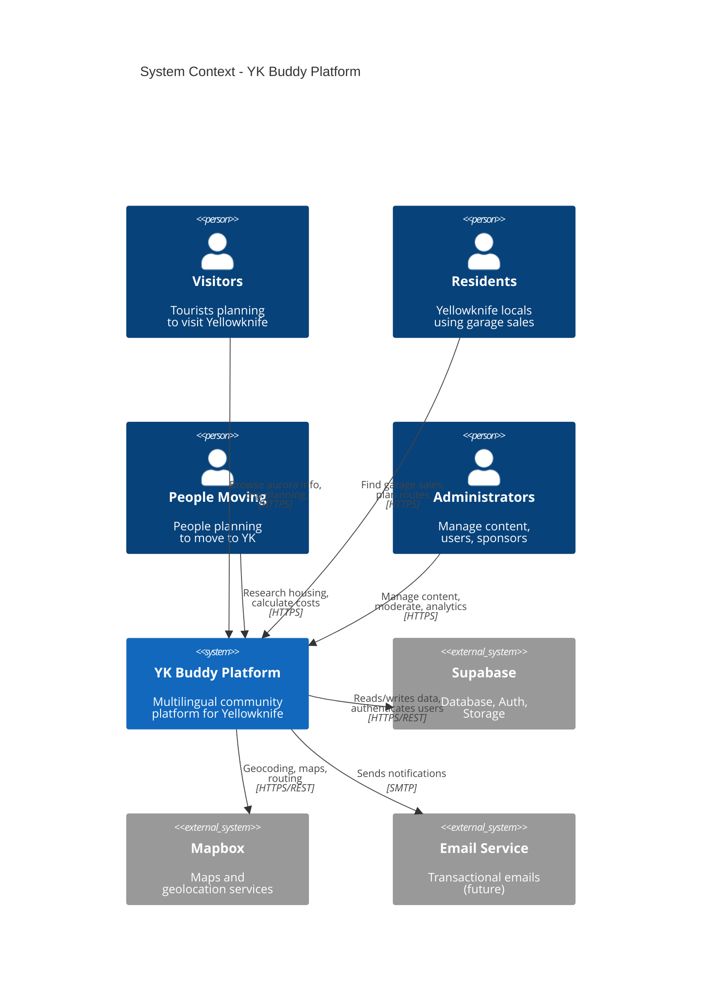

# C4 Model - YK Buddy Architecture

> Visualizing the YK Buddy architecture using the C4 Model: Context, Containers, Components, and Code

**Documentation Standard:** [C4 Model](https://c4model.com/)
**Diagram Tool:** Mermaid
**Last Updated:** January 2025

---

## Overview

The C4 model provides a hierarchical set of architectural diagrams for YK Buddy, allowing us to zoom in and out of the system architecture at different levels of abstraction.

### The Four Levels

1. **[Level 1: System Context](./01-system-context.md)**
   - Shows YK Buddy in context with users and external systems
   - Audience: Everyone (including non-technical stakeholders)

2. **[Level 2: Container Diagram](./02-container-diagram.md)**
   - Zooms into YK Buddy showing the high-level technical building blocks
   - Audience: Technical people inside and outside the development team

3. **[Level 3: Component Diagram](./03-component-diagram.md)**
   - Zooms into individual containers showing their internal structure
   - Audience: Developers and architects

4. **Level 4: Code**
   - Optional: Shows how a component is implemented (see codebase)
   - Audience: Developers

---

## Quick Reference

### System Context (Level 1)

### Key Interactions

| User Type | Primary Use Cases |
|-----------|------------------|
| **Visitors** | Aurora forecasts, trip planning, seasonal guides, attractions |
| **Residents** | Garage sale finder, route planning, local events, community info |
| **Movers** | Housing research, job board, cost calculator, relocation guides |
| **Admins** | Content moderation, user management, sponsor management, analytics |

---

## Diagram Conventions

### Element Types

- **Person** (Blue): Human users of the system
- **Software System** (Blue): The system being documented
- **External System** (Gray): External dependencies
- **Container** (Blue): Deployable/executable units
- **Component** (Blue): Logical groupings of code

### Relationship Types

- **Solid Line**: Synchronous interaction
- **Dashed Line**: Asynchronous interaction
- **Arrow Direction**: Direction of data flow

---

## Navigation

- **[Level 1: System Context →](./01-system-context.md)**
- **[Level 2: Container Diagram →](./02-container-diagram.md)**
- **[Level 3: Component Diagram →](./03-component-diagram.md)**
- **[← Back to Architecture Index](../README.md)**

---

## Maintenance Notes

### When to Update

- **System Context**: When adding new user types or external systems
- **Container Diagram**: When changing deployment architecture or adding new services
- **Component Diagram**: When refactoring major components or adding new feature areas

### How to Update

1. Edit the Mermaid diagram code in the markdown files
2. Verify rendering in VS Code with Mermaid extension or GitHub preview
3. Update the "Last Updated" date in the diagram
4. Cross-reference related Arc42 and ADR documentation

---

## Additional Resources

- [C4 Model Official Site](https://c4model.com/)
- [Mermaid C4 Diagrams](https://mermaid.js.org/syntax/c4.html)
- [Arc42 Architecture Documentation](../arc42/README.md)
- [Architecture Decision Records](../adr/README.md)
